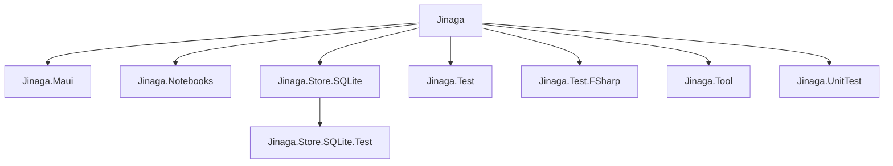

# Jinaga.NET Project Structure

The Jinaga.NET solution consists of several projects, each serving a distinct purpose within the overall architecture. Here's a breakdown of the projects and their relationships:

## Projects

1. **Jinaga**:
   - This is the core library of the Jinaga framework. It includes the main classes and interfaces such as `IJinagaClient`, `JinagaClient`, `LocalJinagaClient`, and various utility classes like `Specification`, `Condition`, and `Relation`.
   - Key functionalities include querying, watching, and managing facts within the Jinaga framework.

2. **Jinaga.Maui**:
   - This project extends the Jinaga framework to work with .NET MAUI (Multi-platform App UI).
   - It provides extension methods for configuring Jinaga authentication and navigation within a MAUI application.

3. **Jinaga.Notebooks**:
   - This project seems to provide integration with Jupyter Notebooks or similar environments.
   - It includes classes for rendering graphs and facts within a notebook environment, making it easier to visualize data managed by Jinaga.

4. **Jinaga.Store.SQLite**:
   - This project provides an SQLite-based storage implementation for Jinaga.
   - It includes classes for managing SQLite connections, executing queries, and storing facts in an SQLite database.

5. **Jinaga.Store.SQLite.Test**:
   - This project contains unit tests for the `Jinaga.Store.SQLite` project.
   - It ensures the correctness and reliability of the SQLite storage implementation by testing various scenarios and edge cases.

6. **Jinaga.Test**:
   - This project contains unit tests for the core Jinaga library.
   - It includes tests for querying, watching, and other core functionalities to ensure the framework behaves as expected.

7. **Jinaga.Test.FSharp**:
   - This project contains F# tests for the Jinaga framework.
   - It provides an alternative testing approach using the F# language, which may offer different perspectives or testing methodologies.

8. **Jinaga.Tool**:
   - This project appears to be a command-line tool for Jinaga.
   - It includes classes for parsing command-line arguments and executing various commands related to Jinaga.

9. **Jinaga.UnitTest**:
   - This project contains additional unit tests for the Jinaga framework.
   - It includes tests for simulated network scenarios and other specific use cases to ensure the robustness of the framework.

## Relationships
- **Core Library (Jinaga)**: The central project that other projects depend on.
- **Extensions (Jinaga.Maui, Jinaga.Notebooks)**: Extend the core functionalities to specific platforms or environments.
- **Storage (Jinaga.Store.SQLite)**: Provides a specific storage implementation for the core library.
- **Testing (Jinaga.Test, Jinaga.Test.FSharp, Jinaga.Store.SQLite.Test, Jinaga.UnitTest)**: Ensure the reliability and correctness of the core library and its extensions.
- **Tools (Jinaga.Tool)**: Provide command-line utilities for interacting with Jinaga.

## Project Structure Graph

This modular structure allows for a clear separation of concerns, making the framework extensible and maintainable.