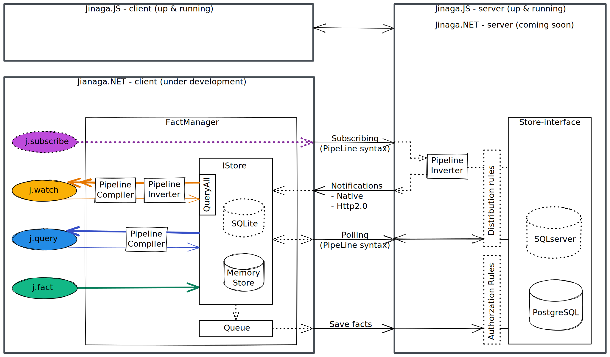

# Jinaga.NET

Resilient, reliable data transfer for .NET.

## What it Does

In [Jinaga](https://jinaga.com), you define a data model in terms of immutable facts.
A fact represents an entity, a change to an entity, or a decision that a user or service has made.

In Jinaga.NET, facts are C# `record`s.:

```C#
[FactType("Corporate.Company")]
record Company(string identifier) {}

[FactType("Corporate.Employee")]
record Employee(Company company, int employeeNumber) {}
```

When a user or service makes a decision, you will add a fact to the system.
This will store it in the local database.
It will also update the local UI.
And it will publish it so that others can learn about the decision.

```C#
var contoso = await j.Fact(new Company("Contoso"));
var jane = await j.Fact(new Employee(contoso, 1));
var bob = await j.Fact(new Employee(contoso, 2));
```

To query facts, write a specification.
Start at a know fact and find all related facts that match that specification.

```C#
var employeesOfCompany = Given<Company>.Match((company, facts) =>
    from employee in facts.OfType<Employee>()
    where employee.company == company
    select employee
);

var contosoEmployees = await j.Query(contoso, employeesOfCompany);
```

A query returns results at a point in time.
If you want to keep a user interface up-to-date, you will need to set up an event-based watch.

```C#
var observer = j.Watch(contoso, employeesOfCompany, employee =>
{
    var component = AddEmployeeComponent(employee);
    return () =>
    {
        RemoveEmployeeComponent(component);
    };
});
```

Finally, if you want to be notified in real time of new information, just subscribe.

```C#
var subscription = j.Subscribe(contoso, employeesOfCompany);
```

The client will open a persistent connection with the server.
The server will notify the client the moment a new employee is hired.
Because the client already set up a watch, the new employee will appear on the UI.

## Running a Replicator

A Jinaga front end connects to a device called a Replicator.
The Jinaga Replicator is a single machine in a network.
It stores and shares facts.
To get started, create a Replicator of your very own using [Docker](https://www.docker.com/products/docker-desktop/).

```
docker pull jinaga/jinaga-replicator
docker create --name my-replicator -p8080:8080 jinaga/jinaga-replicator
docker start my-replicator
```

This creates and starts a new container called `my-replicator`.
The container is listening at port 8080 for commands.
Configure Jinaga to use the replicator:

```C#
var j = JinagaClient.Create(options =>
{
    options.HttpEndpoint = new Uri("http://localhost:8080/jinaga");
});
```

## Roadmap

[Jinaga.NET](https://github.com/jinaga/jinaga.net) is co-evolving with [Jinaga.JS](https://github.com/jinaga/jinaga.js).
Each of these projects has a front end and a back end.
Either front end is intended to work with either back end.
And the back ends are intended to interconnect to form a decision substrate.



### APIs

The primary APIs for Jinaga are:

- `j.Fact` - Add and publish a fact
- `j.Query` - Project the facts matching a specification
- `j.Watch` - Continually update a projection
- `j.Subscribe` - Receive continuous updates from peers

The `Subscribe` API is not fully implemented in Jinaga.JS, and not implemented yet in Jinaga.NET.
The JS version uses polling rather than the intended mechanism of Web Sockets or HTTP/2 Server Push.

### Storage

Jinaga.NET currently has only memory storage, which is packaged with the core library.
The next storage solutions to implement are SQLite to support Xamarin mobile apps and PostgreSQL to support Docker deployment.
After that, the MS SQL Server implementation will support enterprise solutions that need to keep the journal transactionally consistent with the projection.

### Rules

Authorization rules -- which limit the users who can create facts -- are implemented in Jinaga.JS, but not yet in Jinaga.NET.
Distribution rules -- which limit the specifications that a user can query -- are not yet implemented in either.